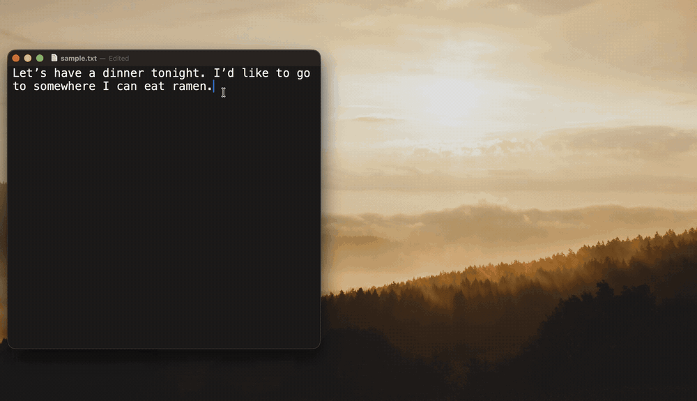

<div align="center">


# Holster

Run your own prompts on selected text, anywhere on macOS.

[](LICENSE)


</div>

Select text in any app, press your hotkey, and the answer streams into a
floating markdown window. Press ⌘↩ to copy it and close.

Holster talks to any OpenAI-compatible endpoint, so the model behind a command
can be a local Ollama, OpenAI, Google Gemini, OpenRouter, or a CLIProxyAPI
sitting in front of a ChatGPT or Claude subscription you already pay for.
Prompts and commands are plain files under `~/.config/holster/`, so you can keep
them in git. Built as a stable replacement for Raycast AI custom commands.

<div align="center">



</div>

## Features

- One global hotkey per command, recorded in Settings with a duplicate check
- Prompts and commands are plain files: git-friendly, hot-reloaded, and editable
  from the built-in Settings UI
- Streaming markdown rendering, GFM tables included
- Smart copy asks the model which part of the answer you meant to paste — the
  translation, the rewritten email, the code — and copies that instead of the
  whole response (one extra request per ⌘↩)
- API keys go to the macOS Keychain, never to `config.yaml`
- A fallback provider takes over when the primary one dies before any output
- Optional text-to-speech: free Edge voices, an OpenAI-compatible
  `/audio/speech`, or the built-in macOS voice
- Holster restores your clipboard after the capture and marks the restore
  transient, so clipboard managers don't log a duplicate
- Headless CLI mode for scripting and for testing prompts
- Native Swift and SwiftUI. No Electron, one small binary

## Privacy

Holster has no telemetry and no backend. Your selected text goes to the endpoint
you configure and nowhere else. The one exception is text-to-speech. With
`tts.provider: edge`, the default in the example config, whatever you ask Holster
to speak goes to Microsoft's read-aloud service. Settings → Speak → Source →
System switches to a voice installed on your Mac, which sends nothing anywhere.

## Install

Apple Silicon only, macOS 14 or later. There is no Intel build.

```sh
brew tap impelcrypto/tap
brew trust impelcrypto/tap   # Homebrew refuses casks from taps you have not trusted
brew install --cask holster
```

Or download `Holster-0.2.0.zip` from the
[latest release](https://github.com/impelcrypto/Holster/releases/latest), unzip
it, and drag `Holster.app` into `/Applications`.

### The first launch needs one approval

Holster is signed but not notarized by Apple, so macOS blocks it the first time
with "Apple could not verify Holster is free of malware". To get past it, open
System Settings → Privacy & Security, scroll down to the Security section, and
click **Open Anyway** next to the Holster message. Every launch after that is
normal.

Notarization needs a paid Apple Developer account, so until then this step comes
with every install route, Homebrew included.

### Build from source

Everything goes through SPM. There is no Xcode project to open, but you do need
Xcode installed for Swift 6.

```sh
git clone https://github.com/impelcrypto/Holster.git
cd Holster
make app       # build Holster.app into ./build.noindex
make install   # copy to /Applications and launch
make test      # unit tests
```

`scripts/bundle.sh` signs with your "Apple Development" certificate when you
have one and falls back to ad-hoc signing otherwise. Under ad-hoc signing macOS
forgets the Accessibility grant after every rebuild, so a stable certificate
saves you a trip to System Settings each time.

## First run

1. Launch the app. A text icon appears in the menu bar and the Settings window
   opens on General, where System Health shows the Accessibility permission
   (needed to read the selection via a synthetic ⌘C) and the config status.
2. `~/.config/holster/` is created with an example config and a grammar check
   prompt.
3. Set up a provider (next section), then select some text anywhere and press ⌘⇧G.

## AI providers

Holster needs one OpenAI-compatible endpoint behind your commands. Pick the one
that matches what you already have.

### Ollama: free, and the quickest to get running

Cloud models run on Ollama's machines, so a 31B model works on a Mac that could
never hold it in memory.

```sh
brew install ollama          # or grab the app from https://ollama.com/download
brew services start ollama   # skip this if you installed the app instead
ollama signin                # free ollama.com account; cloud models need it
ollama pull gemma4:31b-cloud
```

The example config already points an `ollama` provider at
`http://127.0.0.1:11434/v1`, and it needs no API key. Open Settings, pick your
command, set Provider to `ollama` and Model to `gemma4:31b-cloud`. The example
command ships on `cliproxy`, so it keeps failing until you switch it.

The free tier covers light use, with limits that reset per session and per week
([pricing](https://ollama.com/pricing)). To skip the account and the limits, pull
a local model instead: `ollama pull gemma4:12b` weighs about 7 GB and never
leaves your Mac.

### CLIProxyAPI: your ChatGPT or Claude subscription, no API key

[CLIProxyAPI](https://github.com/router-for-me/CLIProxyAPI) signs in to a
subscription you already pay for and serves it on an OpenAI-compatible port. You
pay nothing per token.

```sh
brew install cliproxyapi
cliproxyapi --codex-login    # ChatGPT Plus/Pro, opens a browser
cliproxyapi --claude-login   # Claude Pro/Max
brew services start cliproxyapi
```

The proxy listens on 8317, where the example config's `cliproxy` provider already
points, and it takes an empty API key.

This setup has more moving parts than the other two, so hand this README and
<https://help.router-for.me/> to Claude Code or another coding agent and let it
finish the job. It can install the binary, walk you through the OAuth login, and
write the provider into `config.yaml`.

### OpenCode Go and Gemini API keys

Settings ships presets for `opencode-go` and `gemini`, both on fixed base URLs.
Paste a key into the command editor and it lands in the Keychain rather than in
`config.yaml`. Anything else OpenAI-compatible, OpenRouter for instance, goes
under the `custom` preset with its own base URL. Saving writes the provider into
`providers:` for you.

## Configuration

Everything lives in `~/.config/holster/`. Edit the files directly or use the
Settings window (menu bar icon → Settings…). Both stay in sync because the files
are the single source of truth and the app watches them. Saving from the GUI
re-serializes `config.yaml`, which drops your YAML comments.

```yaml
# config.yaml
providers:                 # any OpenAI-compatible endpoints
  cliproxy:
    base_url: http://127.0.0.1:8317/v1
    api_key: ""            # only for CLI/dev; the app uses macOS Keychain
  ollama:
    base_url: http://127.0.0.1:11434/v1
  opencode-go:             # https://opencode.ai/docs/go/
    base_url: https://opencode.ai/zen/go/v1
    api_key: ""
  gemini:                  # Google Gemini API
    base_url: https://generativelanguage.googleapis.com/v1beta/openai
    api_key: ""
  custom:                  # e.g. OpenRouter; editable from Settings
    base_url: https://openrouter.ai/api/v1
    api_key: ""

default_provider: cliproxy

tts:                       # provider: edge = free Edge voices, sent to Microsoft;
  provider: edge           #   provider: system = macOS voice, nothing sent;
                           #   base_url = OpenAI-compatible /audio/speech
  voice: en-US-AvaMultilingualNeural

commands:
  - name: Grammar Teacher
    hotkey: cmd+shift+g    # modifiers: cmd, shift, opt, ctrl
    prompt: grammar.md     # file under prompts/, {selection} gets replaced
    provider: cliproxy
    model: gpt-5.6-sol
    reasoning: medium      # low / medium / high; omit to send no reasoning field
                           # (on opencode-go an omitted value falls back to low:
                           #  its models think by default, so "none" never helps)
    copy_on_select: true   # selecting text in the result window copies it
    fallback_provider: ollama   # used when the provider fails before any output
    fallback_model: qwen3:8b    # omit to reuse the primary model
```

Prompt files take two placeholders: `{selection}` for the captured selection and
`{clipboard}` for the current clipboard contents.

### API keys

The packaged app keeps the keys you enter in Settings in the macOS Keychain, not
in `config.yaml`. The first time it opens an existing config it also migrates any
plaintext provider or TTS keys into the Keychain and strips them from the file. Development builds launched with `swift run` keep reading
`api_key` from YAML; the packaged app uses the Keychain in both menu-bar and
headless CLI modes.

### Commands in Settings

Each command gets its own editor. It records the hotkey and warns when another
command already claims the combination, lists the provider's models from
`/v1/models` (type the ID when the endpoint has none), and checks the API key. A
Test section runs the draft on a sample sentence before you save.

### Theme

Settings → General → Theme picks System (default), Light, or Dark. It lives in
UserDefaults rather than `config.yaml`.

## Popup shortcuts

| Key | Action |
| --- | --- |
| ⌘↩ | Smart copy: the model picks the part worth pasting, then close |
| ⇧⌘↩ | Copy the full response |
| ⌘S | Speak the selection, or the whole response when nothing is selected |
| ⌘. | Stop generating (Esc also cancels the stream on close) |
| ⌘R | Retry (after an error) |
| Esc | Close |

⌘↩ costs one extra non-streaming request on the command's own provider and
model. The selector only returns line numbers into the response, so it can add
nothing of its own to your clipboard; if it fails or you press Esc while it is
running, you get the full response. ⇧⌘↩ never calls it.

## CLI

Holster runs the same pipeline without the GUI or any permissions, which helps
when you are iterating on prompts and providers:

```sh
Holster --list
Holster --run "Grammar Teacher" --text "It seem wrong."
echo "It seem wrong." | Holster --run "Grammar Teacher"
Holster --help
```

`--config <dir>` points at an alternative config directory and `--no-stream`
disables SSE. Each config directory gets its own Keychain namespace, so API keys
never leak between configs.

## Known limits

- Text-to-speech through CLIProxyAPI does not work, because the proxy does not
  forward `/v1/audio/speech` for subscription auth. Point `tts.base_url` straight
  at a provider with a real API key, or use `provider: edge` or the macOS voice.
- `provider: edge` rides Microsoft Edge's free read-aloud voices over a
  WebSocket. No API key, but it is an unofficial endpoint that may change. On
  any failure Holster drops back to the built-in macOS voice.
- The built-in macOS voice (`provider: system`, or no provider and no base_url)
  honors `tts.voice`, either a name like `Ava` or a full identifier. The standard
  voices sound flat next to Edge's; Premium ones are a free download, and
  [Apple's instructions](https://support.apple.com/guide/mac-help/mchlp2290/mac)
  cover it. An uninstalled voice falls back to the default en-US one.
- A result window that is already open keeps the old theme until the next run.

## Contributing

Issues and pull requests are welcome. Run `make test` before opening one.

### Cutting a release

1. Bump `VERSION`. One line, no `v` prefix. Semver: patch for fixes, minor for
   new commands or settings, major once an existing `config.yaml` stops loading.
2. Commit it and merge to `master`.
3. Run `scripts/release.sh` from `master`.

The script stops on Intel or on a dirty tree, builds the app, zips it with
`ditto` so the code signature survives, and prints the sha256. When a
`homebrew-tap` checkout sits next to this one, it rewrites the cask's `version`
and `sha256` in place. After you confirm, it tags `vX.Y.Z`, pushes the tag, and
creates the GitHub release with the zip attached.

The cask lives in its own repository, so push that one yourself:

```sh
cd ../homebrew-tap
git commit -am "holster X.Y.Z"
git push
```

`VERSION` is the only place the number lives. `scripts/bundle.sh` reads it into
the Info.plist, `scripts/release.sh` reads it for the tag and the zip name.

Signing stays on the "Apple Development" certificate for now, so every release
needs the "Open Anyway" step described under Install. A paid Apple Developer
account would let `notarytool` remove that step, at the cost of resetting
everyone's Accessibility grant once when the certificate changes.

## License

[MIT](LICENSE)
